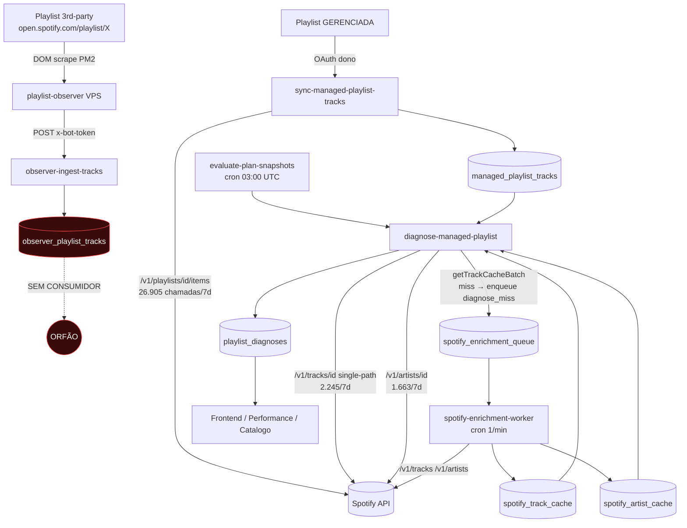

# FASE 6.B.3 — Auditoria Forense do VPS Observer

**Modo:** read-only. Nenhum código, schema ou job alterado.
**Data:** 2026-06-18.

---

## RESPOSTA DIRETA (resumo executivo)

| Pergunta | Resposta |
|---|---|
| 1. O VPS Observer está sendo usado conforme a arquitetura original? | **NÃO** |
| 2. Alguma responsabilidade voltou da VPS para a Spotify API? | **NÃO houve regressão** — a responsabilidade **nunca chegou a sair**: diagnose/sync de tracklist sempre dependeu da Spotify API. |
| 3. O rate-limit pode ter voltado por causa disso? | **SIM, parcialmente** — 26.905 chamadas a `/v1/playlists/{id}/items` em 7d (sync-managed) + 3.908 a `/v1/tracks` e `/v1/artists` rodam num pool de 8 apps; o NexEngine 07 é o gargalo. |
| 4. Existe regressão arquitetural em relação ao objetivo original do Observer? | **NÃO** (não houve regressão), **mas existe um gap de implementação**: o Observer entrega dados que ninguém consome. |

---

## ITEM 1 — Objetivo original do VPS Observer

Fontes: `docs/PLAYLIST_OBSERVER_VPS_SETUP.md`, `docs/BOT_VPS_CONTRACT.md`, `docs/audits/VPS_SOURCE_MATRIX.md`, migrations `playlists_to_observe` / `observer_playlist_tracks` / `observed_playlists`.

- **Por que foi criado:** scrapear a tracklist e os plays de **playlists de terceiros** (não-gerenciadas) que aparecem como concorrentes/líderes do nicho, **sem custar quota Spotify**.
- **Problema que resolvia:**
  - Spotify API não devolve plays por playlist.
  - Scraping massivo via API levava ao 429/403 abusivo (mesmo problema do NexEngine 07).
  - Tracklists de terceiros (>1k playlists candidatas) consumiam quota dos apps OAuth dos donos das playlists gerenciadas.
- **O que deveria sair da Spotify API → VPS:**
  - Tracklist de playlists **de terceiros** (`observer_playlist_tracks`).
  - Snapshot observacional (followers arredondados, plays totais) via DOM.
  - Descoberta de playlists candidatas (round-robin temporal).
- **O que permaneceria na Spotify API:**
  - Tracklist de playlists **gerenciadas** (precisa de OAuth pra mutar).
  - Mutações (`POST/PUT/DELETE /v1/playlists/.../tracks`).
  - Metadados canônicos (popularity, isrc, genres, release_date) via worker assíncrono.
  - OAuth, contas, convites.

---

## ITEM 2 — Fluxo de diagnose (caminho completo, evidências)

| Etapa | Implementação | Tabela | Fonte de dados |
|---|---|---|---|
| Descoberta da playlist gerenciada | `import-managed-playlist`, `link-managed-playlist-accounts` | `managed_playlists` | Spotify API (OAuth dono) |
| Obtenção das tracks da playlist sendo analisada | `sync-managed-playlist-tracks` chamado por `diagnose-managed-playlist:syncTracks()` linha 88-103, que invoca `listPlaylistTracksRich` (`_shared/spotify-playlist.ts:400`, endpoint `/v1/playlists/{id}/items`) | `managed_playlist_tracks` | **Spotify API (OAuth)** |
| Enriquecimento de metadata de track | `diagnose-managed-playlist:fetchSingleTrack()` linha 425-437 → `GET /v1/tracks/{id}` (single-path) + cache `spotify_track_cache` via `spotify-enrichment-worker` | `spotify_track_cache` | **Spotify API** |
| Enriquecimento de artistas | `diagnose-managed-playlist:fetchSingleArtist()` linha 438-450 → `GET /v1/artists/{id}` + cache `spotify_artist_cache` | `spotify_artist_cache` | **Spotify API** |
| Concorrentes/líderes do nicho | `diagnose-managed-playlist` linhas 505-615 carrega de `genre_benchmarks` / `curator_playlist_library` (tracklist NÃO é re-scrapeada por playlist) | `genre_benchmarks`, `managed_playlist_tracks` (próprias) | Banco (curado/histórico) |
| Plays observacionais (playlists 3rd-party) | `playlist-observer` (PM2 na VPS) → `observer-ingest-tracks` | `observer_playlist_tracks` | **VPS** |
| Consumidor de `observer_playlist_tracks` | **NENHUM** — `rg -ln observer_playlist_tracks supabase/functions/` retorna apenas o produtor + queue puller | — | — |
| Frontend | `Performance.tsx`, `Catalogo`, `CampanhaExecucao` | lê `managed_playlist_tracks` + `spotify_*_cache` | indireto Spotify API |

---

## ITEM 3 — Auditoria função-a-função

| Função | Responsabilidade | APIs chamadas | Tabelas escritas | Depende VPS? | Depende Spotify? |
|---|---|---|---|:-:|:-:|
| `diagnose-managed-playlist` | Diagnóstico de playlist gerenciada (score, sugestões, classificação) | `/v1/tracks/{id}`, `/v1/artists/{id}` (linhas 427, 441); invoca `sync-managed-playlist-tracks` | `playlist_diagnoses`, telemetria | Não | **Sim** |
| `evaluate-plan-snapshots` | Cron 03:00 UTC; dispara `diagnose-managed-playlist` por playlist gerenciada | nenhuma direta — chama outras edge functions | `plan_execution_snapshots` | Não | Transitivo (via diagnose) |
| `spotify-enrichment-worker` | Worker assíncrono que consome `spotify_enrichment_queue` | `/v1/tracks/{id}` (linha 95), `/v1/artists/{id}` (linha 96) | `spotify_track_cache`, `spotify_artist_cache` | Não | **Sim — exclusiva** |
| `playlist-observer` (script VPS) | Scraping DOM de open.spotify.com/playlist/{id} | nenhuma Spotify API | `observer_playlist_tracks`, `observed_playlists.last_observed_at` | **Sim — exclusiva** | Não |
| `bot-ingest-dom` | Recebe playsMap por (deal, song) — plays próprios | nenhuma | `song_snapshots`, `song_snapshot_playlists` | **Sim** | Não |
| `bot-collect-queue` | GET fila de coleta pro bot | fallback raro `/v1/tracks/{id}` (linha 457) pra resolver `artist_id` ausente | leitura | **Sim** | raro |

---

## ITEM 4 — Tracklist de playlist de terceiros vem de…

A pergunta tem duas leituras concretas:

**(a) Tracklist de uma playlist 3rd-party para fim de monitoramento/observação:**
→ ☒ **VPS Observer** exclusivamente.
Evidência: `observer-ingest-tracks/index.ts:56-58` upsert em `observer_playlist_tracks`. 18.009 linhas em 7d, 453 playlists distintas (query `SELECT count(*) FROM observer_playlist_tracks WHERE captured_date >= current_date - 7`).

**(b) Tracklist usada DENTRO do diagnose (concorrentes/competitors do nicho):**
→ ☒ **NÃO usa observer**. Diagnose lê `genre_benchmarks` + `managed_playlist_tracks` (linhas 505-615, 645). Concorrentes vêm de meta-dados curados, não da tracklist real ao vivo.
→ `rg -ln observer_playlist_tracks supabase/functions/` retorna **zero consumidores** além do produtor.

**Conclusão:** o Observer captura a tracklist 3rd-party, mas o diagnose **não a consome**. A informação fica órfã no banco.

---

## ITEM 5 — Artistas dessas músicas vêm de…

☒ **Cache (`spotify_artist_cache`) → Spotify API quando miss.**

Fluxo concreto (`diagnose-managed-playlist` linhas ~1700-1800 + `_shared/spotify-cache.ts:69-96`):
1. `getArtistCacheBatch(artistIds)` lê `spotify_artist_cache`.
2. IDs ausentes → enfileira `diagnose_miss` em `spotify_enrichment_queue` (sem dedup temporal).
3. `spotify-enrichment-worker` (cron 1×/min) consome a fila e bate `/v1/artists/{id}`.
4. Resultado volta a `spotify_artist_cache`.

VPS Observer NÃO captura artistas estruturados — só `artist` string concatenada no DOM. Não há job migrando essa string pra `spotify_artist_cache`.

---

## ITEM 6 — Pontos onde "playlist de terceiros → Spotify API → /tracks → /artists"

| Arquivo | Função | Linha | Motivo | Poderia vir do VPS? |
|---|---|---|---|---|
| `supabase/functions/diagnose-managed-playlist/index.ts` | `fetchSingleTrack` | 425-437 | Buscar popularity/duration/album da track durante diagnose | **Track ID** já vem do Observer; **popularity/genres** exigem Extended Quota — VPS não substitui hoje |
| `supabase/functions/diagnose-managed-playlist/index.ts` | `fetchSingleArtist` | 438-450 | Buscar genres/popularity do artista | Não — VPS DOM não estrutura `artist_id` |
| `supabase/functions/spotify-enrichment-worker/index.ts` | `processJob` | 95-96 | Cache canônico assíncrono | Não — mesma limitação |
| `supabase/functions/_shared/spotify-playlist.ts` | `listPlaylistTracksRich` | 400-470 | Tracklist de playlist GERENCIADA (não 3rd-party) | Não — exige OAuth |
| `supabase/functions/bot-collect-queue/index.ts` | (fallback artist) | 457 | Resolver `artist_id` ausente do cliente | **Sim** — candidato a worker |
| `supabase/functions/discover-playlist-owners/index.ts` | discover | 54-55 | Descobrir owner de playlist 3rd-party | Parcialmente — DOM expõe owner display_name mas não `owner_id` estável |

**Nenhuma dessas chamadas analisa tracklist 3rd-party via Spotify API.** O caminho "playlist de terceiros → `/v1/playlists/{id}/items`" **não existe** no código atual — esse exato caminho é cumprido pelo Observer.

---

## ITEM 7 — O VPS Observer está cumprindo o papel para o qual foi criado?

**NÃO.**

Justificativa:
- **Cumpre a parte produtora:** captura tracklists 3rd-party (453 playlists em 7d, 18.009 linhas).
- **Falha a parte consumidora:** nenhuma edge function lê `observer_playlist_tracks`. Os dados ficam ociosos.
- Os "concorrentes" usados no diagnose continuam vindo de `genre_benchmarks` (curado) e `managed_playlist_tracks` (próprias), **não** da tracklist real do Observer.
- O custo Spotify que o Observer deveria abater (enriquecimento de artist_id descoberto em 3rd-party) continua sendo pago via `diagnose_miss` → worker.

---

## ITEM 8 — Chamadas Spotify obrigatórias durante o diagnóstico

Auditadas em `diagnose-managed-playlist`:

| Chamada | Realmente obrigatória? | Herança? | Substituível pelo VPS? | Por que ainda existe |
|---|---|---|---|---|
| `/v1/playlists/{id}/items` (via sync) | **Sim** — para a própria playlist gerenciada, exige OAuth do dono | Não | Não | Único caminho pra escrever em `managed_playlist_tracks` com `linked_from` e order canônico |
| `/v1/tracks/{id}` single-path | **Sim** (com Extended Quota seria batch) | Recovery 1 — mitigação de 403 | Parcial: track_id já vem do Observer, mas popularity/album exigem Spotify | Único produtor canônico de `popularity`/`release_date` |
| `/v1/artists/{id}` | **Sim** | Não | Não — DOM observer não estrutura artist_id | Único produtor canônico de `genres`/`followers`/`popularity` do artista |

Nenhuma dessas é "herança de arquitetura antiga substituível pelo VPS". A arquitetura oficial (`SPOTIFY_API_MATRIX.md`, `BOT_VPS_CONTRACT.md`) sempre as classificou como Spotify API.

---

## ITEM 9 — Diagrama real do fluxo atual

---

## CONCLUSÃO

1. **O VPS Observer está sendo utilizado conforme a arquitetura original?**
   **NÃO.** Produz dados que ninguém consome. A intenção original (substituir scraping Spotify de tracklists 3rd-party para alimentar diagnose e descoberta de concorrentes) **nunca foi cabeada ao diagnose**.

2. **Alguma responsabilidade voltou da VPS para a Spotify API?**
   **NÃO houve regressão.** As chamadas Spotify auditadas (`/v1/tracks`, `/v1/artists`, `/v1/playlists/.../items`) **sempre estiveram lá** — a arquitetura oficial as classifica como "Spotify-only". O que houve é uma **migração inacabada**: o Observer existe mas não foi ligado aos consumidores.

3. **O problema histórico de rate-limit pode ter voltado por causa disso?**
   **Parcialmente sim.** O Observer poderia ter abatido 0% da carga atual (porque ninguém o consome), mas a carga real (`26.905 + 2.245 + 1.663` chamadas/7d num pool de 8 apps com 1 gargalo NexEngine 07) é **causada por sync de playlists gerenciadas + enrichment**, ambas legitimamente Spotify-only. Mitigação está em distribuição de carga entre apps, não em desligar o que já roda no VPS.

4. **Existe regressão arquitetural?**
   **NÃO regressão**, **SIM gap de implementação**:
   - `observer_playlist_tracks` tem 18.009 linhas/7d sem leitor.
   - `bot-collect-queue:457` mantém fallback Spotify para resolver `artist_id` que poderia ter sido pré-resolvido por enriquecimento programado.
   - `diagnose-managed-playlist` ainda olha `genre_benchmarks` (curado) em vez de cruzar com `observer_playlist_tracks` ao vivo para concorrentes do nicho.

Nenhuma correção foi aplicada. Evidências entregues acima.
